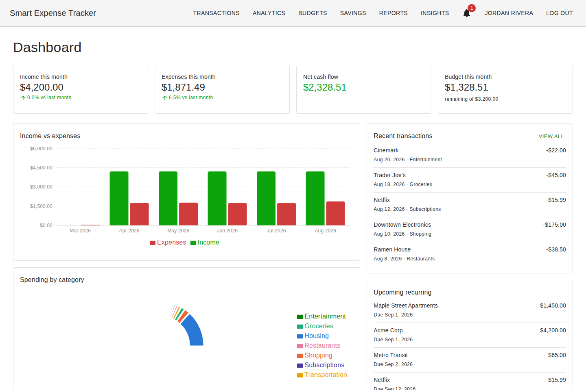
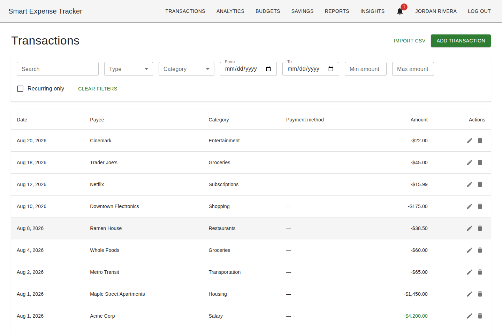
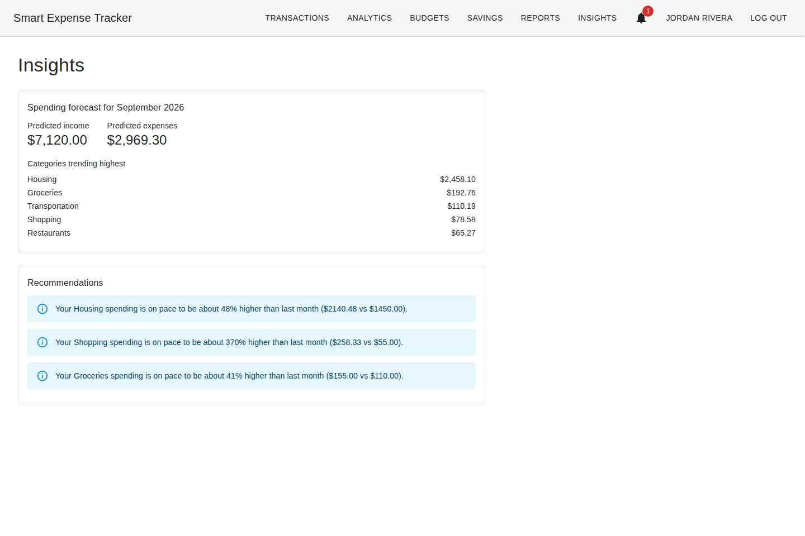
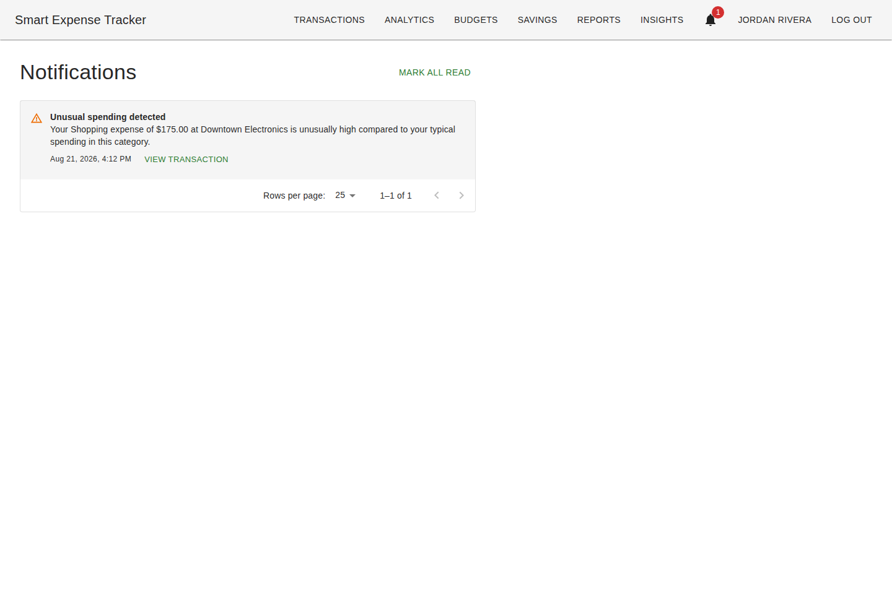

# Smart Expense Tracker

[](https://github.com/alexbrogan10/smartexpensetracker/actions/workflows/ci.yml)

A full-stack personal finance application for tracking income and expenses, managing budgets and savings goals, and surfacing AI-powered spending insights — built as a production-quality portfolio project, end to end: FastAPI + PostgreSQL backend, React + TypeScript frontend, real machine learning (not just the phrase), Docker Compose, and CI.

Built incrementally across 14 milestones, each one implemented, tested against a real Postgres + browser stack, and committed before the next began. See [`docs/architecture.md`](./docs/architecture.md) for how the pieces fit together and [`docs/database.md`](./docs/database.md) for the schema and its design decisions — both explain not just what was built but why, including the couple of places where an original plan changed once a later milestone landed.

## Screenshots

| Dashboard | Transactions |
|---|---|
|  |  |

| Insights (forecast + recommendations) | Notifications |
|---|---|
|  |  |

## Features

- **Accounts & auth** — JWT-based registration/login, profile and password management.
- **Transactions** — income/expense tracking with categories, payment methods, recurring flags, search, filtering, sorting, and pagination.
- **Budgets** — an overall monthly limit plus optional per-category limits, with progress and status (ok/warning/exceeded).
- **Savings goals** — target amount and optional target date, with on-track/behind-pace status computed from elapsed time vs. progress.
- **Dashboard & analytics** — month-over-month summary, category breakdown, income/expense trends, top merchants, upcoming recurring transactions.
- **CSV import & export** — upload a CSV, preview validated/flagged rows before committing, export filtered transactions back out as CSV or Excel.
- **AI category suggestions** — a small text classifier (scikit-learn), trained per-user from that user's own transaction history, suggests a category as you type a new transaction's payee.
- **Spending forecasts** — a linear regression over trailing monthly totals predicts next month's income/expenses and top trending categories.
- **Smart recommendations** — rule-based (not ML) budget-pace, category-trend, and savings-goal-pace warnings, computed fresh from current data.
- **Unusual spending detection** — a statistical outlier test (Tukey's IQR fences) flags transactions that are unusually large for their category, surfaced as persisted, dismissible notifications.
- **Responsive UI** — a collapsible mobile nav, toast feedback on every action, route-level code splitting.

`docs/architecture.md` explains why the three "AI" features above (categorization, forecasting, anomaly detection) each use a genuinely different technique rather than reaching for a model everywhere — and why recommendations, despite the name, aren't ML at all.

## Tech Stack

**Backend:** Python 3.13, FastAPI, SQLAlchemy, Alembic, PostgreSQL, Pydantic, Pandas, Scikit-learn, Uvicorn
**Frontend:** React, TypeScript, Vite, Material UI, React Router, Axios, Recharts
**Auth:** JWT, bcrypt
**Testing:** pytest, React Testing Library / Vitest
**DevOps:** Docker, Docker Compose, GitHub Actions

## Project Structure

```
smart-expense-tracker/
├── backend/       # FastAPI application (app/, tests/, alembic/)
├── frontend/      # React + TypeScript SPA (Vite)
├── docs/          # Architecture, database design, and screenshots
├── sample_data/   # Fictional CSVs for exercising the import feature
└── docker-compose.yml
```

## Getting Started (local development)

### Prerequisites

- Python 3.13
- Node.js 22+
- Docker & Docker Compose (optional, for running Postgres / the full stack)

### Backend

```bash
cd backend
python3.13 -m venv .venv
source .venv/bin/activate
pip install -e ".[dev]"

# Make sure PostgreSQL is running and DATABASE_URL (see .env.example) points at it,
# then apply migrations:
alembic upgrade head

uvicorn app.main:app --reload
```

The API will be available at `http://localhost:8000`. Interactive API docs (Swagger UI) are auto-generated at `http://localhost:8000/docs`, with a health check at `GET /health`.

### Frontend

```bash
cd frontend
npm install
npm run dev
```

The app will be available at `http://localhost:5173`.

### Full stack via Docker Compose

```bash
cp .env.example .env
docker compose up --build
```

This starts PostgreSQL, the backend API, and the frontend together. The backend
container applies Alembic migrations automatically on startup (via
`backend/docker-entrypoint.sh`) before the API starts serving, so a fresh
`docker compose up` always boots against an up-to-date schema. The backend
exposes a Docker `HEALTHCHECK` against `GET /health`, which the frontend
service waits on before starting.

To point the frontend at a different backend URL (e.g. deploying beyond
localhost), set `VITE_API_BASE_URL` in `.env` before building — Vite inlines
it into the built JS at image-build time, so it can't be changed later at
container-run time without rebuilding the image.

### Trying it out with sample data

After registering an account, the fastest way to see the app with real-looking
data is the CSV import feature: go to **Transactions → Import CSV** and upload
[`sample_data/sample_transactions.csv`](./sample_data/sample_transactions.csv)
(51 realistic rows across income and expense categories, some recurring). A
second file, [`sample_transactions_with_errors.csv`](./sample_data/sample_transactions_with_errors.csv),
demonstrates the import validation flow — it's deliberately full of bad rows
(missing fields, invalid dates/amounts, an unknown category, a duplicate pair)
so you can see each one flagged individually in the preview.

## Environment Variables

Copy `.env.example` to `.env` at the project root and adjust as needed. See that file for the full list of variables (database connection, JWT secret, CORS origins, frontend API base URL).

## Running Tests

```bash
# Backend (requires a running PostgreSQL instance for API/integration tests)
cd backend
pytest
pytest --cov=app --cov-report=term-missing  # with coverage

# Frontend
cd frontend
npm test                # run once
npm run test:watch      # watch mode
npm run test:coverage   # with coverage
```

## Continuous Integration

Every push and pull request runs the [CI workflow](./.github/workflows/ci.yml):
a backend job (ruff lint/format, `alembic upgrade head` against a real
PostgreSQL service container, then pytest with coverage), a frontend job
(eslint, prettier, `tsc -b`, vitest, `vite build`), and a job that builds both
Docker images to catch any Dockerfile regressions.

## Documentation

- [`docs/architecture.md`](./docs/architecture.md) — backend layering, frontend structure, auth model, and how the AI/statistics/rules-based features differ.
- [`docs/database.md`](./docs/database.md) — the full schema (ERD) and the reasoning behind each modeling decision, including where the design changed as later milestones landed.

## Known limitations

Documented in detail in `docs/database.md` and `docs/architecture.md`; the notable ones: no soft-delete (deletions are hard deletes), single implicit currency, calendar-month-only budgets, and no recurring-payment due-date reminders (would need scheduler/cron infrastructure this stack doesn't have — the Dashboard's "upcoming recurring" widget covers that ground with a computed projection instead).

## License

[MIT](./LICENSE)
