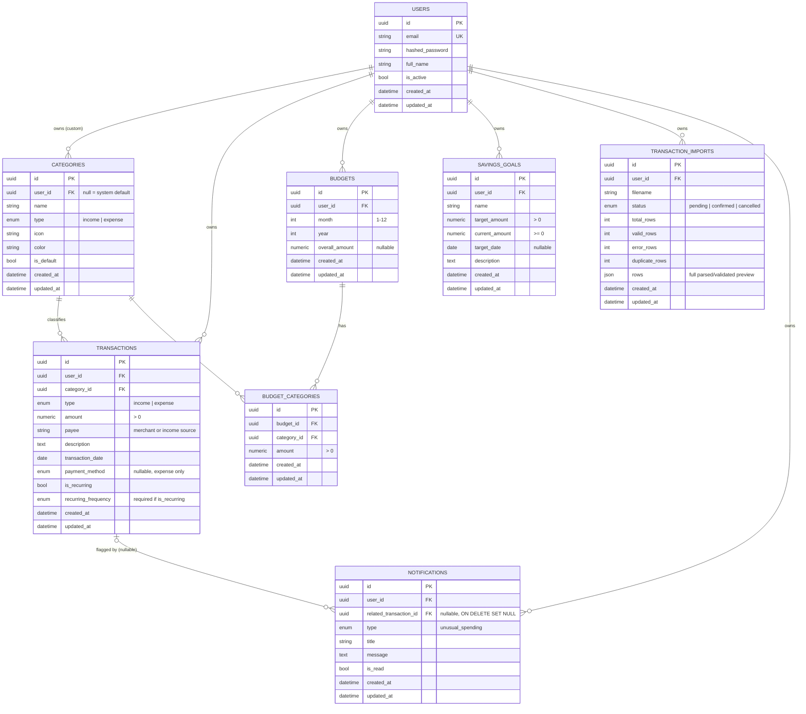

# Database Design

PostgreSQL 16, accessed through SQLAlchemy 2.0 (typed `Mapped[...]` models) with Alembic migrations. This document reflects the final schema; the "Design Decisions" section below notes where the schema evolved from the original Milestone 2 plan as later milestones landed.

## Entity-Relationship Diagram

## Design Decisions

### UUID primary keys

Every table uses a UUID primary key (SQLAlchemy's database-agnostic `Uuid` type, backed by native `uuid` on Postgres) instead of an autoincrement integer. In a financial app, a sequential ID in a URL (`/transactions/1847`) leaks how many records exist and invites enumeration. UUIDs close that off. Every query is still scoped by `user_id` server-side — the UUID choice is defense in depth, not a substitute for that check.

### Transactions: one table, not two

Income and expenses live in a single `transactions` table, discriminated by a `type` column, rather than separate `incomes` / `expenses` tables. The API exposes one `/transactions` collection, and cash-flow totals, search, filtering, and recurring-transaction logic all need to reason about both kinds together — splitting them would mean duplicating that logic across two tables for no real benefit. The one field that differs semantically by type, `payee`, is documented as "merchant for an expense, income source for income" rather than kept as two sparse nullable columns — the frontend labels it appropriately based on `type`.

### Enums stored as `VARCHAR` + `CHECK`, not native Postgres `ENUM`

`TransactionType`, `PaymentMethod`, `RecurringFrequency`, and `CategoryType` are all implemented with SQLAlchemy's `Enum(..., native_enum=False)`, which stores the value as a `VARCHAR` with a `CHECK` constraint instead of a Postgres native enum type. Native enums require an `ALTER TYPE ... ADD VALUE` migration to add a new value later (e.g. a new payment method), which can't run inside a transaction in older Postgres versions and is generally awkward. A check-constrained varchar is a plain, reversible column-level change. The trade-off is a marginally less strict type at the storage layer — enforcement is identical in practice, since the API validates the same enum via Pydantic before it ever reaches the database.

### Money as `Numeric(12, 2)`

All monetary amounts use `Numeric(12, 2)` (fixed-point decimal), never `Float`. Binary floating point cannot represent most decimal currency values exactly, which is unacceptable for anything tracking money. `Decimal` is used consistently in the Python layer as well.

### `Transaction.amount` is always positive

The sign of a transaction is carried by `type` (`income`/`expense`), not by the amount itself — enforced with `CHECK (amount > 0)`. This avoids the classic bug class where a transaction's direction depends on remembering to negate a number somewhere in application code; cash-flow math instead branches explicitly on `type`.

### Recurring metadata lives on the transaction row, permanently

`is_recurring` and `recurring_frequency` are columns on `transactions` rather than a separate `recurring_transaction_rules` table, enforced together by a `CHECK` constraint (`is_recurring = true` requires a non-null `recurring_frequency`, and vice versa). This turned out to be sufficient for the whole project, not just "for now" as originally planned here: the Dashboard's "upcoming recurring" widget (Milestone 6) computes each series' next due date on the fly from its most recent transaction (`compute_next_due_date`, grouped by payee), and Milestone 10 deliberately scoped notifications to unusual-spending flags only, explicitly leaving recurring-payment reminders out because they'd need scheduler/cron infrastructure this stack doesn't have. No feature ever needed to track a rule's next-due-date independently of the transaction history, so the dedicated table this section originally predicted was never built.

### Categories: system defaults + user-owned custom categories, one table

`categories.user_id` is nullable: `NULL` means a system default category (seeded by the initial migration, `is_default = true`), a real UUID means a user-created custom category. This avoids a separate "default categories" table/enum while still letting users add their own. A unique constraint on `(user_id, name, type)` stops a user from creating duplicate categories, while still allowing different users to each have their own "Freelance" category, and allowing the same name to exist as both an income and an expense category.

### Budgets: month/year row + per-category limits

`budgets` holds one row per user per calendar month (`UNIQUE(user_id, month, year)`) with an optional `overall_amount`. Category-level limits live in a separate `budget_categories` join table (`budget_id`, `category_id`, `amount`) rather than as columns on `budgets`, since the set of budgeted categories is user-defined and variable — a fixed column per category would not scale and would waste space for users who only budget a few categories.

### Tables added incrementally, not speculatively

This migration deliberately did not create `transaction_imports` or `notifications` — each was only meaningful once its owning feature existed, and creating them early would have meant empty, unused tables. They were added in the migrations for the milestones that actually needed them:

- **`transaction_imports`** (Milestone 7): one row per CSV upload. `rows` stores the full parsed/validated preview as JSON rather than a relational staging table, since it's transient data — read once at confirm/cancel time and never queried by anything else. Once confirmed, the valid rows become real `transactions`; the import row itself just remains as a record of the batch.
- **`notifications`** (Milestone 10): unlike the on-demand budget/trend/savings insights in the recommendations feature (computed fresh on every request, never stored), an unusual-spending flag is a point-in-time event tied to one transaction that a user reviews and dismisses over time, so it needed its own persisted, `is_read`-tracked row.

One table from the original plan never got built at all: a `category_predictions` audit table, intended in this document's original draft to log AI categorization suggestions. Milestone 8 took a simpler path instead — the categorization model trains from scratch on each request directly from existing `transactions` rows (no separate training-data table needed) and returns a suggestion the user can accept or ignore inline; nothing about that flow needed to be persisted, so the table was dropped from the design rather than built and left unused.

### Referential integrity

- `users → categories/transactions/budgets/savings_goals`: `ON DELETE CASCADE`. Deleting a user removes their financial data (no orphaned rows).
- `categories → transactions`: `ON DELETE RESTRICT`. A category that has transactions pointing to it cannot be deleted outright — this forces an explicit reassignment/cleanup decision rather than silently orphaning or cascading a delete through a user's transaction history.
- `budgets → budget_categories`: `ON DELETE CASCADE`. A budget's category limits have no independent meaning once the budget itself is gone.

### Indexes

Beyond primary keys and the unique constraints above: `users.email` (login lookups), `categories.user_id`, `savings_goals.user_id`, and three composite indexes on `transactions` — `(user_id, transaction_date)`, `(user_id, category_id)`, `(user_id, type)` — covering the access patterns the app will actually use: a user's transaction history in date order, spend-by-category rollups, and income-vs-expense filtering.

## Default category seed data

The initial migration seeds 14 default expense categories and 5 default income categories (matching the project's category list) via `app.db.seed.seed_default_categories()`, called once from the migration's `upgrade()`. The function is idempotent — safe to call again — and is unit-tested independently of the migration itself (`tests/test_models.py`).

## Testing strategy

Model and constraint tests (`tests/test_models.py`) run against an in-memory SQLite database rather than Postgres, which is possible specifically because every model uses SQLAlchemy's database-agnostic types (`Uuid`, `Numeric`, `Enum(native_enum=False)`) instead of Postgres-only dialect types. This keeps the test suite fast with no external service dependency, while the Alembic migration itself is verified against a real PostgreSQL 16 instance (both `upgrade` and `downgrade`) before being committed.

## Known limitations / future work

- No soft-delete: deletions are hard deletes (constrained by the FK behavior above). Acceptable for a portfolio project; a real product might add `deleted_at` to `transactions` for recoverability.
- No multi-currency support — all amounts are assumed to be a single implicit currency.
- `budgets` are calendar-month only; no support for custom budget periods (e.g. a 4-week cycle).
- No recurring-payment due-date reminders (only the unusual-spending notification type exists) — this would need a scheduler/cron this stack doesn't have, and was deliberately deferred rather than built as a one-off (see Milestone 10 in `docs/architecture.md`).
